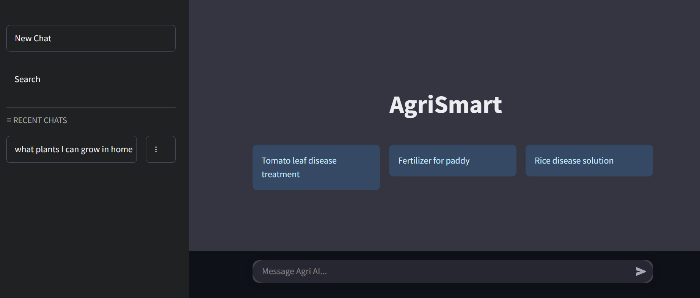
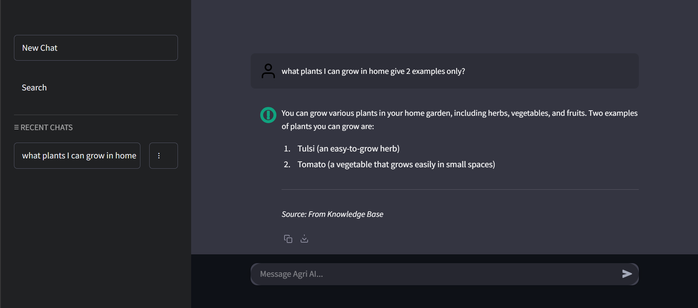
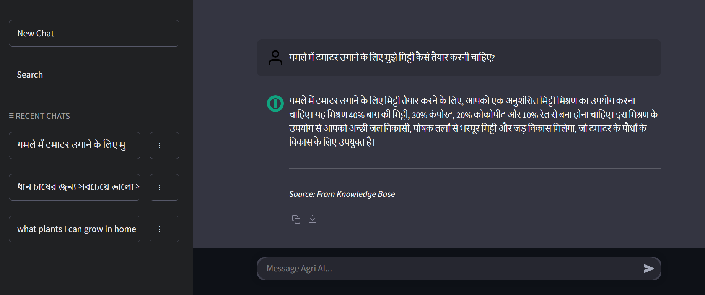

# 🌾 AI Agriculture RAG Assistant

A Retrieval-Augmented Generation (RAG) based Agricultural Assistant built using **FastAPI**, **Groq LLM**, **Chroma Vector DB**, and **Local Embeddings**.
The system answers farming-related queries using a **Knowledge Base first**, then falls back to **AI-generated responses** when information is not available.

---
### Home Screen


### RAG Response with Source



# 🚀 Features

* RAG based Question Answering
* Knowledge Base + AI fallback
* Local embedding model (offline capable)
* Chroma Vector Database
* FastAPI REST API
* Query caching (exact + semantic)
* Chat history using SQLite
* Source attribution (KB / AI)
* File-level source tracking
* Production-ready structure

---

# 🧠 How It Works

User Query  
   ↓  
Embedding Generation  
   ↓  
Vector Similarity Search (ChromaDB)  
   ↓  
Retrieve Relevant Documents  
   ↓  
Prompt Construction (RAG)  
   ↓  
Groq LLM Response Generation  
   ↓  
Return Answer + Source Attribution  

---

## 📁 Project Structure

```
AgriSmart-AI/
│
├── backend/
│   ├── app.py
│   ├── cache_utils.py
│   ├── config.py
│   ├── database.py
│   ├── llm_service.py
│   ├── models.py
│   ├── prompts.py
│   └── vector_db.py
│
├── frontend/
│   ├── app.py
│   ├── config.py
│   ├── export.py
│   ├── storage.py
│   ├── styles.py
│   └── ui.py
│
├── .gitignore
├── README.md
└── requirements.txt
```

---

# ⚙️ Installation

## 1. Clone Repository

```
git clone https://github.com/your-username/agri-rag-assistant.git
cd agri-rag-assistant/backend
```

---

## 2. Create Virtual Environment

Windows:

```
python -m venv venv
venv\Scripts\activate
```

Mac/Linux:

```
python3 -m venv venv
source venv/bin/activate
```

---

## 3. Install Requirements

```
pip install -r requirements.txt
```

---

# 🔐 Environment Variables

Create `.env` file:

```
GROQ_API_KEY=your_groq_api_key
GROQ_MODEL=your model name

DOCS_PATH=data/docs
VECTORSTORE_PATH=data/vectorstore
```

---

# 📚 Add Knowledge Base

Add `.txt` files inside:

```
data/docs/
```

Example:

```
data/docs/
    crops.txt
    fertilizer.txt
    irrigation.txt
```

System automatically:

* Loads documents
* Splits into chunks
* Creates embeddings
* Stores in Chroma

---

# ▶️ Run Server

```
uvicorn app:app --reload
```

Server starts:

```
http://127.0.0.1:8000
```

---

# 🧪 API Usage

## Health Check

```
GET /
```

Response

```
{
  "status": "online"
}
```

---

## Chat Endpoint

```
POST /chat
```

Request

```
{
  "query": "What plants can I grow at home?"
}
```

Response

```
{
  "answer": "You can grow basil, mint, spinach...",
  "chat_id": "1234",
  "source": "Knowledge Base",
  "file": "home_plants.txt"
}
```

---

# 🧠 Source Detection Logic

The system automatically determines:

* **Knowledge Base** → if similarity score high
* **AI Generated** → if no relevant docs found

No unreliable LLM tagging used.

---

# ⚡ Caching

Two-level caching:

### Exact Match Cache

Same question → instant response

### Semantic Cache

Similar question → cached response

Improves performance significantly.

---

# 🗄️ Database

SQLite stores:

Chats table

* chat_id
* title
* created_at

Messages table

* chat_id
* sender
* message

File: `chat.db`

---

# 🧩 Tech Stack

* FastAPI
* Groq LLM
* ChromaDB
* Sentence Transformers
* SQLite
* NumPy
* LangChain

---

# 🔥 Example Queries

* What fertilizer is best for rice?
* How to grow tomatoes at home?
* What causes leaf yellowing?
* Best crops for summer season?
* How much water does wheat need?

---

# 📈 Future Improvements

* Stream response
* Multi-language support
* Voice input
* Image crop detection
* Farmer advisory mode
* Web UI frontend
* Conversation memory

---

# ⭐ If you like this project

Give it a star on GitHub!
